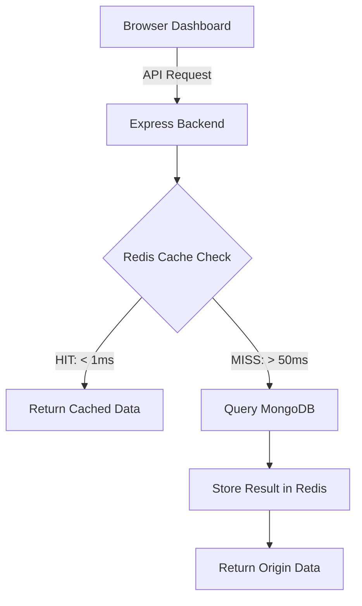

# ⚡ CacheMaster Pro — Distributed Cache System

A high-performance **Cloud Computing** demonstration project using **Node.js (Express)**, **Redis**, and **MongoDB**. This system visualizes the massive performance gain provided by in-memory caching in distributed architectures.

---

## 🚀 Modern Development Workflow (Hot-Reload)

This project is optimized for an elite developer experience. You can modify code in real-time without ever restarting your containers.

- **Backend (Node.js)**: Uses `nodemon` to watch and restart the server automatically on file changes.
- **Frontend (HTML/JS)**: Uses `live-server` to trigger automatic browser refreshes when you save your HTML, CSS, or JS files.
- **Docker Sync**: Bind mounts ensure your local changes are instantly reflected inside the containers, while anonymous volumes protect `node_modules` from host/container conflicts.

---

## 🛠️ Instant Local Setup

Ensure you have **Docker** and **Docker Compose** installed.

```bash
# 1. Clone the repository
git clone https://github.com/AbdelkbirNA/CloudCache.git
cd CloudCache

# 2. Launch the entire infrastructure
docker-compose up --build
```

- **Frontend Dashboard**: [http://localhost:3000](http://localhost:3000)
- **Backend API**: [http://localhost:5000](http://localhost:5000)
- **MongoDB**: `localhost:27017`
- **Redis**: `localhost:6379`

---

## 📊 Performance Intelligence Dashboard

The redesigned **Enhanced Classical** dashboard provides deep technical insights into the system's performance:

1. **Latency Analyzer**: Real-time Chart.js visualization of request times over time.
2. **Time to Data**: Precise digital readout (ms) for every request.
3. **Source Efficiency**: Live calculation of the **Speed Multiplier** (e.g., how many times faster Redis was than the last Database query).
4. **Data Pedigree**: Visual tags identifying the origin of every data object (`REDIS` vs `MONGODB`).

---

## 🏗️ Architecture & Strategy



### Key Strategies
- **Cache-Aside (Lazy Loading)**: Minimizes database load by keeping frequent data in RAM.
- **Auto-Invalidation**: All write operations (`POST`, `DELETE`) automatically purge related cache keys to ensure data consistency.
- **Time-To-Live (TTL)**: 60-second default expiration for all cache keys.

---

## 🌐 API Reference

| Method | Endpoint | Description | Cache Role |
|--------|----------|-------------|------------|
| GET | `/api/products` | All products | **READ** |
| GET | `/api/products/search?q=` | Key search | **READ** |
| POST | `/api/products` | Create entry | **FLUSH ALL** |
| DELETE | `/api/products/:id` | Purge entry | **FLUSH ALL** |
| GET | `/api/cache/stats` | Redis metrics | **MONITOR** |
| DELETE | `/api/cache/flush` | Manual wipe | **RESET** |

---

## ☁️ Deployment (Cloud Ready)

The project is structured for easy deployment on platforms like **Render**, **Railway**, or **AWS ECS**.

1. **Database**: Use MongoDB Atlas (Free Tier).
2. **Cache**: Use Upstash Redis (Serverless).
3. **App**: Set `MONGO_URI` and `REDIS_URL` as environment variables.

---
*Created for Cloud Computing Case Studies — Performance Optimization via Distributed Memory.*
